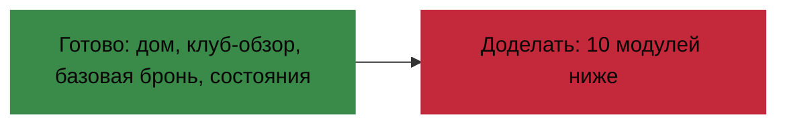

# Бриф для дизайнера · Доработка макетов ClubTableTracker

> **Цель:** достроить дизайн до полного покрытия продукта. Текущие шаблоны
> [`V2 ClubTableTracker-дизайн.html`](V2 ClubTableTracker-дизайн.html) (веб) и
> [`V3 ClubTableTracker-мобильный.html`](V3 ClubTableTracker-мобильный.html) (мобайл)
> закрывают ≈ 30 % функционала — только «витрину» (дом → клуб → базовая бронь).
> Этот документ — спека на недостающие экраны.

---

## 0. Вердикт по текущим шаблонам

**Дизайн-система — отличная, переиспользуем полностью.** Покрытие продукта — **недостаточное**:
пропущены мессенджер, авторизация, настройки, админка клуба, карта кампании, детали события и
весь продвинутый флоу бронирования. То есть пропущена самая «тяжёлая» часть UX.

---

## 1. Контекст продукта

**ClubTableTracker** — система бронирования столов для варгейм-клубов (Warhammer 40K, Age of
Sigmar, Horus Heresy, Kill Team и т. д.). Платформа: веб (React) + мобайл (Flutter) + бэк (.NET).

Пользовательские роли:
- **Игрок** — состоит в клубах, бронирует столы, участвует в событиях, переписывается.
- **Модератор клуба** — те же права + модерирование броней (ростеры, кики).
- **Админ клуба** — полное управление клубом: столы, участники, события, галерея, чаты.
- **Глобальный админ** — создание клубов, перевыпуск ключей.

---

## 2. Что переиспользовать (не выдумывать заново)

### 2.1 Дизайн-токены (уже заданы в V2/V3)
- **Палитра:** `--blood-red #C4283B`, `--brass #C4A35A`, `--bg #070609`, `--surface #141018`,
  `--success #3A8A4A`, `--warn #C49030`, `--danger #C4283B`, `--fg #E8DCC8`.
- **Шрифты:** Russo One (дисплей/заголовки), Fira Sans (тело), JetBrains Mono (моно/время).
- **Формы:** рубленые углы через `clip-path: polygon(...)`, шестиугольные аватары и статус-точки.
- **Текстуры:** шумовой оверлей `body::before` (opacity 0.03), готические разделители `✠`,
  «печати чистоты» (purity seals).

### 2.2 Готовые компоненты
`.btn` (+ `.btn-primary/brass/secondary/danger/ghost/sm/xs`), `.badge` (success/warn/danger/
brass/blood/neutral), `.card`, `.dataslate`, `.input/.select`, `.tabs`, `.avatar`,
`.status-dot`, `.timeline`, `.cal-week/.cal-strip`, `.map-table`, `.skeleton`, `.dialog`,
мобильные `.sheet` (bottom sheet), `.fab`, `.tabbar`.

### 2.3 Лексикон (важно для всех текстов)
«Присягнуть» (зарегистрироваться на событие), «освятить стол» (забронировать), «исторгнуть»
(отменить/кикнуть), «вокс-канал» (чат), «когитатор» (настройки/система), «воин» (участник),
«орденская твердыня» (клуб), «печать» (подтвердить).

---

## 3. Inventory экранов (что есть / чего нет)

| # | Экран | В V2 (веб) | В V3 (мобайл) | Источник данных |
|---|-------|:---:|:---:|---|
| 1 | Дом · список клубов | ✅ | ✅ | [`ClubController`](../ClubTableTracker.Server/Controllers/ClubController.cs:18) |
| 2 | Клуб · обзор столов/карты/событий | ✅ | ✅ | [`ClubController`](../ClubTableTracker.Server/Controllers/ClubController.cs:17) |
| 3 | Бронь · базовое создание | ⚠️ части. | ⚠️ части. | [`BookingController.CreateBooking`](../ClubTableTracker.Server/Controllers/BookingController.cs:197) |
| 4 | Состояния loading/empty/error | ✅ | ❌ | — |
| 5 | **Авторизация / онбординг** | ❌ | ❌ | [`AuthController`](../ClubTableTracker.Server/Controllers/AuthController.cs:37) |
| 6 | **Мессенджер** | ❌ | ❌ | [`MessengerController`](../ClubTableTracker.Server/Controllers/MessengerController.cs:14) |
| 7 | **Настройки / профиль** | ❌ | ❌ | [`UserController`](../ClubTableTracker.Server/Controllers/UserController.cs:24) |
| 8 | **Админка клуба** | ❌ | ❌ | [`ClubAdminController`](../ClubTableTracker.Server/Controllers/ClubAdminController.cs:13) |
| 9 | **Детали события** | ❌ | ❌ | [`ClubEvent`](../ClubTableTracker.Server/Models/ClubEvent.cs:4) |
| 10 | **Карта кампании** | ❌ | ❌ | [`CampaignMapController`](../ClubTableTracker.Server/Controllers/CampaignMapController.cs:41) |
| 11 | **Продвинутое бронирование** | ❌ | ❌ | [`BookingController`](../ClubTableTracker.Server/Controllers/BookingController.cs:197) |
| 12 | **Лента активности / лог** | ❌ | ❌ | [`BookingController.GetActivityLog`](../ClubTableTracker.Server/Controllers/BookingController.cs:159) |
| 13 | **Уведомления** | ❌ | ❌ | [`FcmService`](../ClubTableTracker.Server/Services/FcmService.cs) |
| 14 | **Глобальный админ** | ❌ | ❌ | [`AdminController`](../ClubTableTracker.Server/Controllers/AdminController.cs:33) |

---

## 4. Сквозные требования (ко всем новым экранам)

1. **Три состояния каждого списка/панели:** loading (skeleton), empty (с иконкой `✠/☠` и CTA),
   error («Вокс-связь потеряна» + кнопка «Повторить»). Шаблон уже есть в V2 — переиспользовать.
2. **Двойная раскладка:** веб (desktop ≥ 768px, multi-column) + мобайл (≤ 430px, single-column,
   bottom sheet вместо dialog, `min-height: 44px` для тапов, `safe-area-inset`).
3. **Навигация мобайл:** таббар уже обещает 5 пунктов (`Клубы / Столы / Бронь / Воины / Лог`) —
   отрисовать экраны под **«Воины»** (участники клуба) и **«Лог»** (лента активности), иначе таббар
   ведёт в пустоту.
4. **Доступность:** `focus-visible` (outline латунь), `aria-label` на иконочных кнопках,
   контраст текста ≥ 4.5:1, размер тап-целей ≥ 44px на мобайле.
5. **Иконки:** единый stroke-стиль (как в существующем таббаре), не вводить новые «стили».

---

## 5. Спеки недостающих экранов

> Приоритеты: **P0** (ядро, без них релиз невозможен) → **P1** → **P2**.

---

### P0-1 · Авторизация и привязка аккаунтов

**Цель:** вход через Яндекс (основной), привязка Google/VK, объединение аккаунтов.

**Данные:** [`AuthController`](../ClubTableTracker.Server/Controllers/AuthController.cs:37):
`POST /api/auth/google|yandex|vk`, `POST /api/auth/link-google`; флаги `googleLinked/yandexLinked/
vkLinked` из `GET /api/user/me`.

**Экраны:**
1. **Login / Onboarding** (только для незалогиненных):
   - Логотип + слоган («In the grim darkness, there is only war»).
   - Главная CTA-кнопка **«Войти через Яндекс»** (blood-red).
   - Под ней — мелким: «или привяжите аккаунт позже в Когитаторе».
   - Состояние: `!yandexConfigured` → предупреждение «Яндекс не настроен».
2. **OAuth Callback / обработка кода:** спиннер + текст «Устанавливаем вокс-связь…», на ошибке —
   экран с причиной (неверный код / несоответствие state / сеть) и кнопкой «Назад».
3. **Блок «Способы входа» (в настройках, не отдельный экран):** бейджи `Google ✓ / Яндекс ✓ / VK ✓`,
   кнопка «Объединить с профилем Google» если `!googleLinked`. Состояние merge-конфликта: «этот
   Google уже привязан к другому ордену» → `400` с понятным текстом.

**Мобайл:** login-экран полноэкранный (без таббара); кнопка запускает системный браузер
(`flutter_web_auth_2`), возврат по deep link `ru.clubtabletracker://oauth/yandex`.

**Состояния:** не настроено / загрузка / успех / ошибка сети / ошибка провайдера / конфликт merge.

---

### P0-2 · Мессенджер (самый большой пробел)

**Цель:** чаты клуба и личные переписки с ответами, пересылкой, unread, пушами.

**Данные:** [`MessengerController`](../ClubTableTracker.Server/Controllers/MessengerController.cs:14):
`GET /chats`, `GET /chats/{id}/messages`, `POST /chats/{id}/messages` (`ReplyToId`, текст ≤ 4000),
`DELETE /chats/{id}/messages/{id}`, `POST /chats/direct`, `POST /chats/{id}/read`. Типы чатов:
личный, групповой приватный, групповой публичный (клуба).

**Экраны:**
1. **Список чатов:**
   - Строка: аватар/иконка группы, имя, превью последнего сообщения, время, **unread-бейдж** (hex).
   - Группировка/пометка: личные vs групповые публичные клуба (к ним можно «присоединиться»).
   - FAB/кнопка «Новый чат» → выбор воина для личного чата.
   - Фильтр/поиск.
2. **Окно переписки:**
   - Шапка: имя чата, аватар, число участников (для группы), иконка «назад».
   - Пузыри сообщений: свои (blood-red выравнивание вправо) / чужие (surface влево), аватар
     отправителя в группе, время, **статус доставки** (`Status`).
   - **Ответ на сообщение:** блок-цитата над инпутом (имя + обрезанный текст) с кнопкой ✕.
   - **Пересылка / копирование:** контекстное меню (на веб — правый клик, на мобайл — long-press).
   - Поле ввода: textarea (autorow), кнопка отправки (печать ✠), лимит 4000 символов.
   - Разделители дат («Сегодня», «Вчера», дата).
   - Unread-разделитель «Новые сообщения».
3. **Создание/управление группой (админ):** имя, лого, участники (+/−), публичный/приватный.

**Мобайл:** список и переписка — отдельные экраны; клавиатура не перекрывает инпут
(`viewport visualViewport`, см. существующий [`MessengerPage.tsx`](../clubtabletracker.client/src/pages/MessengerPage.tsx:144)).

**Состояния:** нет чатов («Вокс-канал тих — начните диалог»), нет сообщений, ошибка отправки
(кнопка повтора на пузыре), offline.

---

### P0-3 · Настройки / профиль (Когитатор)

**Цель:** редактирование профиля и偏好.

**Данные:** [`UserController`](../ClubTableTracker.Server/Controllers/UserController.cs:24):
`PUT display-name | game-systems | booking-colors | bio | city | fcm-token`; `GET /api/user/me`.

**Секции (карточки/dataslate):**
1. **Аватар + имя для отображения** (загрузка аватара, если есть эндпоинт — уточнить; имя из
   аккаунта Google/Яндекс/VK как readonly-подсказка).
2. **О себе** (bio, многострочное, лимит по модели).
3. **Город** (input/select).
4. **Игровые системы** (чек-листы: W40K, Kill Team, Horus Heresy, AoS, Warcry и т. д. — из
   [`GameSystemConstants`](../ClubTableTracker.Server/Models/GameSystemConstants.cs)).
5. **Цвета брони** (палитра: myBooking / othersBooking / freeSlot / eventFreeSlot + «сбросить»).
6. **Способы входа** (см. P0-1, блок привязки).
7. **Уведомления** (тумблеры пушей + FCM-токен статус).
8. **Выход** (danger-кнопка).

**Мобайл:** вертикальный скролл, секции в `dataslate`-карточках, инпуты ≥ 44px.

---

### P1-1 · Админка клуба (самая объёмная)

**Цель:** управление клубом для админа/модератора. Доступ: по ключу (`X-Club-Key`) или по роли
(`X-Club-Id` + JWT с `IsAdmin`). 30+ эндпоинтов в
[`ClubAdminController`](../ClubTableTracker.Server/Controllers/ClubAdminController.cs:13).

**Вкладки (табы, как в существующем [`ClubAdminPage.tsx`](../clubtabletracker.client/src/pages/ClubAdminPage.tsx:17)):**

1. **Столы** — CRUD: номер, размер (S/M/L), поддерживаемые системы, позиция на карте (для
   пространственной карты). Действия: создать, редактировать, **копировать**, удалить. Превью на
   карте-сетке.
2. **Участники** — таблица участников: имя, город, системы, статус (`Approved/Pending/Kicked`),
   бейджи ролей (Магистр=админ, Капеллан=модератор), иконка 🗝️ «с ключом». Действия:
   approve/reject/kick, set-moderator, set-admin, set-key, **добавить ручного участника**
   (manual, без аккаунта) + редактирование его города/систем. Бейдж «заявки» (Pending count) в
   заголовке вкладки.
3. **События** — CRUD событий (см. P1-2 + P1-3): заголовок, тип (Tournament/Campaign/Other),
   даты start/end, система, столы, макс. участников, гейм-мастер, описание, загрузка
   регламент/регламент2/mission map (drag&drop файлов PDF/DOCX/изображения), участники
   (invite/remove).
4. **Галерея** — лого клуба + сетка фото (загрузить/удалить), лимиты по типам файлов
   (магические байты в контроллере: jpeg/png/webp/gif).
5. **Декорации** — элементы оформления клуба (CRUD через `decorations`).
6. **Чаты** — управление групповыми чатами клуба: создать/удалить, участники +/−, лого.

**Мобайл:** вкладки скроллом сверху, таблицы участников → карточки/список, формы в bottom sheet,
загрузка файлов → кнопка «Выбрать файл» (фото-пикер на мобайле).

**Состояния:** нет участников/событий/фото, ошибки загрузки (не тот тип/размер), confirm-диалоги
на деструктивных действиях (kick/delete).

---

### P1-2 · Детали события

**Цель:** страница события с регистрацией, регламентами, картой миссий, гейм-мастером.

**Данные:** [`ClubEvent`](../ClubTableTracker.Server/Models/ClubEvent.cs:4);
[`EventController`](../ClubTableTracker.Server/Controllers/EventController.cs:45) `register/
unregister`; участник кампании может бронировать столы на весь срок (см.
[`BookingController`](../ClubTableTracker.Server/Controllers/BookingController.cs:214)).

**Контент:**
- Шапка: заголовок, тип-бейдж (LIVE/Tournament/Campaign), даты, система, бейдж участия.
- Описание, **гейм-мастер** (аватар + имя).
- **Файлы:** регламент (PDF/DOCX), регламент 2, **карта миссий** (изображение) — карточки-ссылки
  с иконкой типа файла и кнопкой «скачать/открыть».
- Участники: список аватаров + счётчик `N / MaxParticipants`; кнопка **«Присягнуть»/«Отозвать»**.
- Для кампании → ссылка/кнопка на **карту кампании** (P1-3).
- Связанные столы (TableIds).

**Мобайл:** вертикальный скролл, файлы — горизонтальный скролл карточек.

**Состояния:** событие прошло, регистрация закрыта (мест нет), файлы отсутствуют.

---

### P1-3 · Карта кампании

**Цель:** интерактивный граф территорий кампании. Это уникальная фича продукта.

**Данные:** [`CampaignMapController`](../ClubTableTracker.Server/Controllers/CampaignMapController.cs:41)
+ модель [`CampaignMap`](../ClubTableTracker.Server/Models/CampaignMap.cs:4): блоки (Title, PosX,
PosY), связи (From/To block), фракции по блоку (FactionIndex, Influence), `MaxInfluence`,
`Factions`, `FactionColors`.

**UI:**
- Холст с узлами-блоками (гексагоны/ромбы в стилистике), соединёнными связями (линии/стрелки).
- Каждый блок: название, распределение влияния по фракциям (горизонтальная полоса = доля
  `Influence`), цвет фракции из `FactionColors`.
- Легенда фракций (название + цвет) сверху/сбоку.
- Управление (для админа/гейм-мастера): создать/переместить/удалить блок, создать/удалить связь,
  редактировать влияние фракции, настройки карты (MaxInfluence, список фракций).
- Зум/пан (на мобайле — pinch-zoom).

**Мобайл:** тот же холст во весь экран, легенда — раскрывающаяся шторка.

**Состояния:** карта не создана («Кампания ещё не развёрнута»), нет блоков, загрузка графа.

---

### P1-4 · Продвинутое бронирование (доработать базовый диалог)

**Цель:** покрыть весь флоу, а не только создание. Источник:
[`BookingController`](../ClubTableTracker.Server/Controllers/BookingController.cs:197).

**Недостающие части:**
1. **Диалог создания (расширить):** время start/end, стол, система, **DOUBLES 2×2** (до 4 игроков),
   `IsForOthers` (бронь за другого), выбор соперников/партнёров (по игровым системам).
2. **Ростеры (армейские списки):** редактор многострочного текста ростера у владельца и каждого
   участника; модerator может задать ростер за любого. Источник: `GET/PUT {id}/roster`,
   `{id}/player-roster`. Поля: `OwnerRoster`, `Roster`.
3. **Просмотр/действия над бронью (модалки):** owner-modal, moderator-modal, game-info-modal,
   player-roster-modal (в [`ClubPage.tsx`](../clubtabletracker.client/src/pages/ClubPage.tsx:1814)
   уже 4 вида модалок — отрисовать все).
4. **Приглашения:** invite-player / accept-invite / decline-invite → состояние участника
   (`Invited/Accepted/...`). Бейджи статусов.
5. **Действия:** join/leave, **move-table** (перенос на другой стол), **reschedule** (перенос
   времени), kick-participant, **annul** (аннулировать), delete, share (шера бронирования).

**Состояния:** прошедшая бронь (read-only), конфликт времени, лимит 30 дней вперёд (с исключением
для участников кампании), нет свободных столов, превышен лимит игроков.

---

### P2-1 · Лента активности / лог

**Данные:** [`BookingController.GetActivityLog`](../ClubTableTracker.Server/Controllers/BookingController.cs:159)
(за последний месяц): `Action`, `UserName`, `TableNumber`, `BookingStartTime/EndTime`, `Timestamp`.
Фильтр по клубу.

**UI:** вертикальная хронология (reuse `.timeline`), иконки действий (создал/отменил/перенёс/
присоединился/кикнул), фильтр по клубу и типу действия.

**Мобайл:** отдельный экран под таббар-пункт «Лог».

---

### P2-2 · Уведомления

**Данные:** [`FcmService`](../ClubTableTracker.Server/Services/FcmService.cs), `notification_debug_screen`.

**UI:**
- **Центр уведомлений** (выпад/экран): входящие пушки (приглашения в бронь, новые сообщения,
  события), unread-бейдж на иконке «вокс» в навбаре.
- **Настройки пушей** (в профиле): тумблеры по типам, статус FCM-токена, debug-экран.

---

### P2-3 · Глобальный админ

**Данные:** [`AdminController`](../ClubTableTracker.Server/Controllers/AdminController.cs:33):
список клубов, создание, `regenerate-key`. Вход по Master Key.

**UI:** таблица клубов + форма создания, кнопка «перевыпустить ключ» с confirm. Мини-экран,
только для суперпользователя.

---

## 6. Чеклист сдачи (критерии приёмки)

- [ ] Каждый экран имеет веб- и мобайл-раскладку.
- [ ] Каждый список/панель имеет состояния loading / empty / error.
- [ ] Использованы только токены и компоненты из V2/V3 (новые — согласованы отдельно).
- [ ] Все деструктивные действия (kick/delete/annul) имеют confirm-диалог в стилистике.
- [ ] Соблюдён Grimdark-лексикон (см. §2.3).
- [ ] Все тап-цели на мобайле ≥ 44px, навигация таббаром не ведёт в пустоту.
- [ ] Ростеры/чаты/карта кампании проверены на реальных данных модели.

---

## 7. Рекомендуемый порядок работ

1. **P0:** Авторизация → Мессенджер → Настройки.
2. **P1:** Админка клуба → Детали события → Карта кампании → Продвинутое бронирование.
3. **P2:** Лента/лог → Уведомления → Глобальный админ.

Каждый экран — отдельный артифакт в `plans/` (например `V2-...-auth.html`,
`V3-...-messenger.html`) или дополнение в существующие файлы V2/V3.

---

## 8. Ревью доставки P0 (V4) — статус и замечания

Доставлено 6 файлов P0: веб/мобайл × авторизация/мессенджер/настройки.
**Качество высокое:** токены и компоненты переиспользованы корректно, тап-цели ≥ 44px,
`safe-area` на мобайле, состояния в основном есть. Но **P0 закрыт не на 100%** — есть
пункты на доработку.

### ✅ Принято без замечаний
- **Авторизация (веб):** login / loading / error / not-configured / linked-accounts /
  merge-conflict — все состояния из брифа на месте.
- **Мессенджер (веб + мобайл):** двухпанельный/полноэкранный layout, пузыри mine/theirs,
  reply-quote с ✕, разделители дат, unread-divider, status ✓, empty-состояние, поиск.
- **Настройки (веб):** аватар (корректно «нельзя сменить» — эндпоинта загрузки аватара в
  [`UserController`](../ClubTableTracker.Server/Controllers/UserController.cs:24) нет,
  `AvatarUrl` приходит из OAuth), имя/bio/город, 8 игровых систем, способы входа, 4 тумблера
  пушей + FCM-статус, danger-зона «Исторгнуть», toast «Сохранено».

### 🔧 Замечания (доработать в рамках P0)

| # | Где | Замечание |
|---|-----|-----------|
| 1 | Мобайл · Настройки | **Нет секции «Цвета брони»** — на вебе она есть. Добавить (3–4 палитры + сброс). |
| 2 | Мессенджер · оба | **Не отрисован контекст-меню** (правый клик / long-press): ответить, переслать, копировать, удалить. Reply-quote показывает лишь результат, а триггер-меню нет. |
| 3 | Мессенджер · оба | **Нет управления группой (админ):** создание/удаление группы, участники +/−, лого (`POST/DELETE chats`, `chats/{id}/members`, `chats/{id}/logo`). |
| 4 | Веб · Настройки | Цвета брони: **3 палитры вместо 4** — пропущен `eventFreeSlot` (слот под событие). |
| 5 | Мобайл · Авторизация | **Нет состояния merge-конфликт** («Google уже привязан к другому ордену») — на вебе есть, на мобайле забыли. |
| 6 | Мессенджер | **Loading-состояние** чатов не показано (skeleton-стили есть, но экран не отрисован). |

### ⚠️ Не относится к P0, но помнить
- Таббар мобайла «Воины»/«Лог» по-прежнему без экранов — закроется в P1 (участники уже
  есть в V3-клубе) и P2-1 (лента-лог).

### Итог по продукту (промежуточный, P0)
P0 ≈ закрыт (после п. 1–6 — полностью). На момент первой поставки P0.

---

## 9. Финальный ревью полного набора V4 (P0 + P1 + P2)

Дизайнер доставил **все** недостающие модули в веб- и мобайл-вариантах. Покрытие продукта
теперь **≈ 95–100%** — закрыты все 14 пунктов inventory (§3). Качество высокое, токены
переиспользованы, появились интерактивные заготовки (контекст-меню, bottom sheets, модалки).

### ✅ Покрыто (новые файлы)
- **P1-1 Админка клуба** (веб/мобайл): 6 вкладок — столы (карта-редактор + CRUD), участники
  (таблица/карточки, approve/kick/роль/ключ/системы, ручные), события (CRUD + drag&drop файлов),
  галерея, настройки клуба (часы/shortname/цвет бейджа/декорации), чаты.
- **P1-2 Детали события** (веб/мобайл): тип/система/даты, описание, гейм-мастер, файлы
  (регламент/регламент2/карта миссий), участники N/Max, «Присягнуть/Отозвать», состояния
  (прошедшее/мест нет).
- **P1-3 Карта кампании** (веб/мобайл): интерактивный граф блоков со связями, сетка влияния по
  фракциям, легенда, тулбар (+блок/+связь/влияние/удалить/экспорт).
- **P1-4 Продвинутое бронирование** (веб/мобайл): ростер, перенос на другой стол, reschedule,
  kick участника, аннулирование — в модалках/bottom sheets.
- **P2-1 Лента/лог** (веб/мобайл): фильтры-чипы, вертикальная хронология с цветными метками,
  пагинация, empty-state.
- **P2-2 Уведомления** (веб/мобайл): фильтры, карточки с иконкой/временем/действиями
  (принять/отклонить), unread-метка.
- **P2-3 Глобальный админ** (веб/мобайл): таблица клубов, создание, генерация/revoke ключа.

### ✅ Исправлено из punch-list §8
1. **Мобайл · Настройки · Цвета брони** — добавлены, причём 4 палитры (включая «Слоты событий»).
2. **Мессенджер · контекст-меню** — веб: правый клик → меню; мобайл: long-press → bottom sheet.
3. **Мессенджер · управление группой** — диалог/шторка создания (имя/тип/лого).
5. **Мобайл · Авторизация · merge-конфликт** — состояние добавлено.
6. **Мессенджер · loading** — skeleton добавлен (веб + мобайл).

### 🔴 БЛОКЕР: повреждена кириллица (mojibake)
В **4 файлах** русские надписи в новых интерактивных компонентах превратились в `????`/`????????`
— файлы нужно пересохранить в UTF-8 и вписать текст заново:
- [`v4-веб-мессенджер.html`](v4-веб-мессенджер.html) — контекст-меню (Ответить/Переслать/
  Копировать/Удалить) и диалог управления группой (заголовок, лейблы, кнопки).
- [`v4-мобайл-мессенджер.html`](v4-мобайл-мессенджер.html) — `ctx-sheet` и `group-sheet` (те же пункты).
- [`v4-мобайл-авторизация.html`](v4-мобайл-авторизация.html) — блок merge-конфликт («Конфликт
  слияния» / «Продолжить»).

> Это единственный must-fix: дизайн **нельзя отдавать в вёрстку** с `????`-плейсхолдерами.

### ⚠️ Мелкие замечания (не блокеры)
| # | Где | Замечание |
|---|-----|-----------|
| 4 | Веб · Настройки | Цвета брони: **3 палитры** (нет `eventFreeSlot`), тогда как на мобайле их 4. Привести к единообразию. |
| D | Веб/Мобайл · Бронирование | Блок назван «Действия магистра» — но `move-table`/`reschedule`/`annul`/`delete` доступны и **владельцу** брони (см. [`BookingController`](../ClubTableTracker.Server/Controllers/BookingController.cs:197)). Отразить owner-действия отдельно. |
| C | `-полный` файлы | [`V4 ...-веб-полный.html`](V4%20ClubTableTracker-веб-полный.html) и [`V4 ...-мобильный-полный.html`](V4%20ClubTableTracker-мобильный-полный.html) — это старые V2/V3 (с прежним багом `</nav></nav>`), без интеграции новых экранов. Название «полный» вводит в заблуждение; либо переименовать, либо собрать единый сводный макет. |
| E | Мобайл · таббар | В `-мобильный-полный` пункты «Воины»/«Лог» по-прежнему не привязаны — но отдельные экраны ленты/участников теперь есть. |

### Итог
**Дизайн достаточен по покрытию** (весь продукт, обе платформы). До готовности к вёрстке —
**одно блокирующее исправление** (mojibake) и пара мелочей. После этого набор можно считать
production-ready дизайн-макетом.

---

## 10. Пост-фикс статус (правки применены)

Блокер и мелочи из §9 устранены:

- 🔴 **Mojibake (блокер) — ИСПРАВЛЕНО.** Восстановлена кириллица в
  [`v4-мобайл-авторизация.html`](v4-мобайл-авторизация.html) (блок merge-конфликта),
  [`v4-веб-мессенджер.html`](v4-веб-мессенджер.html) (контекст-меню + диалог группы),
  [`v4-мобайл-мессенджер.html`](v4-мобайл-мессенджер.html) (ctx-sheet + group-sheet).
  Поиск `????` по всем `*.html` → **0 совпадений**.
- ⚠️ **Веб-настройки · 4-я палитра цветов** (`eventFreeSlot` / «Слоты событий») — добавлена,
  теперь совпадает с мобайлом.
- ⚠️ **Бронирование · owner vs moderator** — блоки разделены по реальным правам
  ([`BookingController`](../ClubTableTracker.Server/Controllers/BookingController.cs:197)):
  - **Владелец** (`annul`/`delete`/`reschedule` + свой ростер/invite) — отдельный блок.
  - **Только магистр** (`move-table`/kick/чужой ростер) — отдельный блок; раздел «Перенос стола»
    помечен «только магистр». Правки в [`v4-веб-бронирование.html`](v4-веб-бронирование.html) и
    [`v4-мобайл-бронирование.html`](v4-мобайл-бронирование.html).
- ⚠️ **Нейминг «-полный»** — в оба файла-каркаса добавлен комментарий-указатель: это
  дизайн-система + дом/клуб/бронь; полный набор экранов — в `v4-*-*.html`.
- ⚠️ **Таббар «Воины»/«Лог»** — в мобильном каркасе добавлены экраны `screen-warriors` и
  `screen-log`, кнопки привязаны, `switchScreen` обновлён. Мёртвых пунктов таббара больше нет.

**Статус: набор V4 production-ready.** Покрытие — весь продукт (P0+P1+P2, веб + мобайл),
кодировка чистая, действия рассованы по ролям корректно, навигация не ведёт в пустоту.
