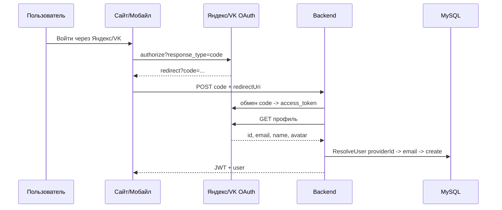

# План: авторизация через Яндекс и ВКонтакте

## Статус

| # | Шаг | Статус |
|---|-----|--------|
| 0 | Регистрация приложений в Яндекс.OAuth и VK ID | ✅ Готово |
| 1 | Backend — модель + EF-миграция | ✅ Готово |
| 2 | Backend — общая логика `ResolveUser` | ✅ Готово |
| 3 | Backend — сервисы Yandex/Vk | ✅ Готово |
| 4 | Backend — эндпоинты `/api/auth/yandex`, `/api/auth/vk` | ✅ Готово |
| 7a | Инфра — env-переменные и docker-compose | ✅ Готово |
| 5 | Сайт (React) — кнопки + callback-роуты + конфиг | ✅ Готово |
| 6 | Мобайл (Flutter) — `flutter_web_auth_2` + deep links | ⬜ Не начат |
| 7b | Инфра — README, `build_mobile.ps1` secrets | ⬜ Не начат |
| 8 | Тестирование | ⬜ Не начат |

---

## Архитектура (почему не как у Google)

Google у нас работает через **ID-token (One Tap)** — клиент получает подписанный JWT, сервер верит подписи. **Яндекс и VK так не умеют** — у них классический **OAuth 2.0 Authorization Code Flow**:



`client_secret` живёт только на бэкенде; клиенты получают те же JWT, что и при входе через Google.

## Привязка аккаунтов (принятое решение)

В [`ResolveUserAsync`](../ClubTableTracker.Server/Controllers/AuthController.cs:188):
1. Искать по идентификатору провайдера (`YandexId` / `VkId`).
2. Если не найден — искать по `email` (case-insensitive, trimmed) и привязать (проставить идентификатор провайдера, дозаполнить пустые имя/аватар/email).
3. Если не найден нигде — создать нового пользователя.

Логика единообразна для Google/Яндекс/VK.

---

## ✅ Шаг 1 — Модель и миграция (ГОТОВО)

- [`AppUser.cs`](../ClubTableTracker.Server/Models/AppUser.cs:16): добавлены
  ```csharp
  [MaxLength(100)] public string? YandexId { get; set; }
  [MaxLength(100)] public string? VkId { get; set; }
  ```
- [`AppDbContext.cs`](../ClubTableTracker.Server/Data/AppDbContext.cs:32): уникальные индексы с фильтром `WHERE ... IS NOT NULL` для `YandexId` и `VkId` (защита от дублей, NULL разрешён).
- Миграция `20260629..._AddUserYandexAndVkIds` создана. Применяется автоматически при старте через `db.Database.Migrate()` в [`Program.cs`](../ClubTableTracker.Server/Program.cs:76).

## ✅ Шаг 2 — Общая логика входа (ГОТОВО)

- [`AuthController.ResolveUserAsync()`](../ClubTableTracker.Server/Controllers/AuthController.cs:188) — поиск/создание/привязка.
- Существующий Google-эндпоинт переведён на `ResolveUserAsync` (поведение для текущих пользователей не изменилось: поиск по `GoogleId`).

## ✅ Шаг 3 — Сервисы провайдеров (ГОТОВО)

- [`YandexAuthService.cs`](../ClubTableTracker.Server/Services/YandexAuthService.cs:1):
  - `ExchangeCodeAsync(code, redirectUri)` → POST `https://oauth.yandex.ru/token` (form-urlencoded, basic-auth client_id:client_secret, grant_type=authorization_code) → `access_token`.
  - `GetUserInfoAsync(accessToken)` → GET `https://login.yandex.ru/info` (заголовок `Authorization: OAuth <token>`) → id, `default_email`, `real_name`/`display_name`, аватар через `https://avatars.yandex.net/get-yapic/<id>/islands-200`.
- [`VkAuthService.cs`](../ClubTableTracker.Server/Services/VkAuthService.cs:1):
  - `ExchangeCodeAsync` → POST `https://id.vk.com/oauth2/auth` (grant_type=authorization_code, client_id, client_secret, code, redirect_uri, device_id?) → возвращает `VkTokenResult(AccessToken, UserId, Email)`.
  - `GetUserInfoAsync` → GET `https://api.vk.com/method/users.get?v=5.199&fields=photo_200&access_token=...` → id, имя/фамилия, photo_200. Email из токен-ответа (VK отдаёт не всегда).
- Зарегистрированы в DI через `AddHttpClient<T>()` в [`Program.cs`](../ClubTableTracker.Server/Program.cs:24).

## ✅ Шаг 4 — Эндпоинты (ГОТОВО)

- `POST /api/auth/yandex` — тело `{ code: string, redirectUri: string }`.
- `POST /api/auth/vk` — тело `{ code: string, redirectUri: string, deviceId?: string }`.
- Возвращают `{ token, user }` — тот же формат, что у `/api/auth/google`.
- При ошибке обмена/валидации — `400 Bad Request` с понятным сообщением.

## ✅ Шаг 7a — Конфигурация env (ГОТОВО)

- [`appsettings.json`](../ClubTableTracker.Server/appsettings.json:13): секции `Yandex` и `Vk` (`ClientId`/`ClientSecret`).
- [`docker-compose.yml`](../docker-compose.yml:18): проброшены `Yandex__ClientId/Secret`, `Vk__ClientId/Secret` в backend; `VITE_YANDEX_CLIENT_ID`/`VITE_VK_CLIENT_ID` в frontend (общие с `YANDEX_CLIENT_ID`/`VK_CLIENT_ID` из `.env`).
- [`Dockerfile`](../clubtabletracker.client/Dockerfile:11) + [`entrypoint.sh`](../clubtabletracker.client/entrypoint.sh:12) (frontend): добавлены `ARG VITE_YANDEX_CLIENT_ID`/`ARG VITE_VK_CLIENT_ID` (build-time токены `__VITE_*__`) и `sed`-подстановка в `entrypoint.sh` — по образцу Google. **Без этого** Vite вшивал бы `""` и кнопки Яндекс/VK не появились бы в production-сборке (именно это наблюдалось на go40k.ru).
- [`.env.example`](../.env.example:7) и [`clubtabletracker.client/.env.example`](../clubtabletracker.client/.env.example:8): добавлены переменные с инструкциями.

**Сборка:** `dotnet build ClubTableTracker.Server/ClubTableTracker.Server.csproj` — успех. Фронтенд: `npm run build` с build-time токенами `__VITE_GOOGLE/YANDEX/VK_CLIENT_ID__` — успех; проверено, что все три токена присутствуют в `dist/*.js` (по 1 вхождению) → `entrypoint.sh` заменит их на runtime-значения из `.env`.

---

## ✅ Шаг 0 — Регистрация приложений (ВЫПОЛНЕНО)

### Яндекс (Yandex ID / Яндекс.OAuth)
1. https://oauth.yandex.ru/client/new — создать приложение.
2. **Платформы → Веб-сервисы**, `Redirect URI`:
   - `https://go40k.ru/auth/yandex/callback` (прод)
   - `https://localhost:5173/auth/yandex/callback` (локально, для dev-сервера Vite)
   - для мобайла — отдельная платформа с deep link схемой (см. Шаг 6).
3. **Доступы**: достаточно данных, что отдаёт `login.yandex.ru/info` по умолчанию (email, имя). При желании явно отметить «Доступ к логину, имени и фамилии».
4. Сохранить `ClientID` и `ClientSecret` → в `.env`: `YANDEX_CLIENT_ID`, `YANDEX_CLIENT_SECRET`.

### ВКонтакте (VK ID)
1. https://id.vk.com/business/ — создать приложение (тип «VK ID» / «Авторизация»).
2. Разрешённые `redirect_uri`:
   - `https://go40k.ru/auth/vk/callback`
   - `https://localhost:5173/auth/vk/callback`
   - для мобайла — deep link (см. Шаг 6).
3. Получить `client_id` и `client_secret` → в `.env`: `VK_CLIENT_ID`, `VK_CLIENT_SECRET`.
4. Для мобайла включить платформу Android/iOS, прописать package name / bundle id и схему deeplink (например `vk<client_id>`).

> После получения id/secret: заполнить `.env` (локально) и секреты CI (для мобайла, см. Шаг 7b).

---

## ✅ Шаг 5 — Сайт (React + Vite) (ГОТОВО)

Цель: рядом с кнопкой Google на главной добавить кнопки «Войти через Яндекс» и «Войти через ВК», реализовать OAuth-callback-роуты.

### Реализовано
- [`oauthConfig.ts`](../clubtabletracker.client/src/oauthConfig.ts:1) — единый конфиг: `googleClientId`/`yandexClientId`/`vkClientId`, флаги `is{Google,Yandex,Vk}Configured`, `buildOAuthAuthorizeUrl()` (генерит `state` → `sessionStorage`), `verifyOAuthState()` (одноразовая CSRF-проверка), `oauthRedirectUri()`.
- [`googleConfig.ts`](../clubtabletracker.client/src/googleConfig.ts:1) — теперь реэкспортирует из `oauthConfig` (обратная совместимость).
- [`main.tsx`](../clubtabletracker.client/src/main.tsx:6) и [`HomePage.tsx`](../clubtabletracker.client/src/pages/HomePage.tsx:4) — импорты переключены на `oauthConfig`.
- [`HomePage.tsx`](../clubtabletracker.client/src/pages/HomePage.tsx:318): шапка входа переработана в flex-блок — Google One Tap + кнопки «Яндекс» (`#FC3F1D`) и «ВКонтакте» (`#0077FF`); кнопки показываются по `is*Configured`, при отсутствии всех трёх — предупреждение.
- [`OAuthCallbackPage.tsx`](../clubtabletracker.client/src/pages/OAuthCallbackPage.tsx:1) — приём `code`/`state`, проверка state, POST на `/api/auth/<provider>`, сохранение JWT в `localStorage`, редирект на `/`; обработка ошибок провайдера/сети/CSRF.
- [`App.tsx`](../clubtabletracker.client/src/App.tsx:19): роуты `/auth/yandex/callback` и `/auth/vk/callback`.
- [`SettingsPage.tsx`](../clubtabletracker.client/src/pages/SettingsPage.tsx:246): подписка «Имя из Google-аккаунта» → «Имя из аккаунта (Google/Яндекс/VK)».
- **Сборка:** `tsc -b` — успех; `eslint .` — 0 ошибок.
- ⚠️ Поправка к §5.2: VK использует **новый** flow VK ID — authorize URL `https://id.vk.com/authorize` (а не `oauth.vk.com`), чтобы совпасть с бэкенд-обменом через [`id.vk.com/oauth2/auth`](../ClubTableTracker.Server/Services/VkAuthService.cs:52).

### 5.1. Конфиг клиента
- [`googleConfig.ts`](../clubtabletracker.client/src/googleConfig.ts:1) → обобщить в [`oauthConfig.ts`](../clubtabletracker.client/src/oauthConfig.ts:1) (или добавить рядом), экспортировать:
  ```ts
  export const googleClientId = import.meta.env.VITE_GOOGLE_CLIENT_ID ?? ''
  export const yandexClientId = import.meta.env.VITE_YANDEX_CLIENT_ID ?? ''
  export const vkClientId = import.meta.env.VITE_VK_CLIENT_ID ?? ''
  export const isGoogleConfigured = ...
  export const isYandexConfigured = yandexClientId !== '' && yandexClientId !== 'your-yandex-client-id'
  export const isVkConfigured = vkClientId !== '' && vkClientId !== 'your-vk-client-id'
  ```
- Обновить импорты в [`main.tsx`](../clubtabletracker.client/src/main.tsx:6) и [`HomePage.tsx`](../clubtabletracker.client/src/pages/HomePage.tsx:4).

### 5.2. Кнопки входа (redirect-based flow)
- [`HomePage.tsx`](../clubtabletracker.client/src/pages/HomePage.tsx:319): рядом с `GoogleLogin`:
  - **Яндекс**: `<a href={yandexAuthUrl}>Войти через Яндекс</a>`, где
    ```
    https://oauth.yandex.ru/authorize?response_type=code&client_id=<YANDEX_CLIENT_ID>&redirect_uri=<encodeURIComponent(origin + '/auth/yandex/callback')>&state=<random>
    ```
  - **VK**: `<a href={vkAuthUrl}>Войти через ВК</a>`,
    ```
    https://id.vk.com/authorize?response_type=code&client_id=<VK_CLIENT_ID>&redirect_uri=<encodeURIComponent(origin + '/auth/vk/callback')>&state=<random>
    ```
  - `origin` = `window.location.origin` (на проде `https://go40k.ru`, локально `https://localhost:5173`) — он же `redirectUri` в запросе к бэкенду, чтобы совпало.
  - Сгенерировать случайный `state`, сохранить в `sessionStorage`, проверить в callback (защита от CSRF).
  - Кнопки показывать только если `isYandexConfigured` / `isVkConfigured` (аналогично Google).

### 5.3. Callback-страницы и роуты
- Создать [`pages/OAuthCallbackPage.tsx`](../clubtabletracker.client/src/pages/OAuthCallbackPage.tsx:1) — принимает `provider` (`'yandex' | 'vk'`) через проп/роут-параметр:
  1. Прочитать `code` и `state` из `useSearchParams`.
  2. Проверить `state` против `sessionStorage` (если есть); при несовпадении — ошибка.
  3. POST на `/api/auth/yandex` или `/api/auth/vk` с `{ code, redirectUri: origin + '/auth/<provider>/callback' }`.
  4. При успехе: `localStorage.setItem('token', token)`, редирект на `/`.
  5. При ошибке: показать сообщение + кнопка «Назад».
- [`App.tsx`](../clubtabletracker.client/src/App.tsx:1): добавить роуты
  ```tsx
  <Route path="/auth/yandex/callback" element={<OAuthCallbackPage provider="yandex" />} />
  <Route path="/auth/vk/callback" element={<OAuthCallbackPage provider="vk" />} />
  ```

### 5.4. UI/тексты
- [`SettingsPage.tsx`](../clubtabletracker.client/src/pages/SettingsPage.tsx:245): обобщить «Имя из Google-аккаунта» → «Имя из аккаунта», тексты-подсказки тоже сделать нейтральными.
- (Опционально, на будущее) показывать привязанные провайдеры в профиле.

### 5.5. Проверка на сайте
- Логин через Яндекс → редирект на callback → сохранение токена → попадание в приложение.
- Логин через VK (если VK не отдаёт email — пользователь создаётся с пустым email, привязка только по `VkId`).
- Повторный логин — не создаёт дубль.
- Вход тем же email через другой провайдер — привязка.

---

## ⬜ Шаг 6 — Мобайл (Flutter)

Цель: на экране входа добавить кнопки Яндекс/VK, открыть системный браузер/вкладку, поймать редирект с `code`, обменять через бэкенд.

### 6.1. Зависимость
- [`pubspec.yaml`](../MobileFlutter/pubspec.yaml:1): добавить `flutter_web_auth_2: ^<latest>` (кросс-платформенное открытие браузера и перехват редиректа).

### 6.2. Deep link-схемы (нативная настройка)
- **Android** (`android/app/src/main/AndroidManifest.xml`): добавить `<intent-filter>` со схемами:
  - `app://oauth/yandex` (или `ru.clubtabletracker://oauth/yandex`)
  - `app://oauth/vk`
  Эти же redirect_uri зарегистрировать в кабинетах Яндекс/VK (Шаг 0, мобильные платформы).
- **iOS** ([`Info.plist`](../MobileFlutter/ios/Runner/Info.plist:1)): `CFBundleURLTypes` с теми же схемами.

### 6.3. Экран входа
- [`home_screen.dart`](../MobileFlutter/lib/screens/home_screen.dart:149): рядом с `_handleGoogleLogin` добавить `_handleYandexLogin()` и `_handleVkLogin()`:
  ```dart
  Future<void> _handleYandexLogin() async {
    final redirectUri = 'ru.clubtabletracker://oauth/yandex';
    final authUrl = Uri.parse('https://oauth.yandex.ru/authorize').replace(queryParameters: {
      'response_type': 'code',
      'client_id': yandexClientId,
      'redirect_uri': redirectUri,
    }).toString();
    final result = await FlutterWebAuth2.authenticate(
      url: authUrl,
      callbackUrlScheme: 'ru.clubtabletracker',
    );
    final code = Uri.parse(result).queryParameters['code'];
    if (code == null) { _showSnack('Не удалось получить код'); return; }
    final data = await _api.yandexLogin(code, redirectUri);
    final token = data['token'] as String;
    await AuthService.saveToken(token);
    // ... навигация, как в _handleGoogleLogin
  }
  ```
  Для VK — аналогично (`https://oauth.vk.com/authorize`, `callbackUrlScheme: 'vk<client_id>'` или общий).

### 6.4. API-сервис
- [`api_service.dart`](../MobileFlutter/lib/services/api_service.dart:322): добавить методы (по образцу `googleLogin`):
  ```dart
  Future<Map<String, dynamic>> yandexLogin(String code, String redirectUri) async { /* POST /api/auth/yandex */ }
  Future<Map<String, dynamic>> vkLogin(String code, String redirectUri) async { /* POST /api/auth/vk */ }
  ```

### 6.5. Конфиг
- [`constants.dart`](../MobileFlutter/lib/constants.dart:25): добавить `yandexClientId` и `vkClientId` (подставляются CI, как сейчас `googleServerClientId`).

### 6.6. Проверка на мобайл
- Те же сценарии, что на сайте. Особое внимание — корректность перехвата deep link (на Android требуется, чтобы браузер возвращал в приложение; проверять в Chrome и системном браузере).

---

## ⬜ Шаг 7b — Инфра (документация и сборка мобайла)

- [`README.md`](../ClubTableTracker.Server/README.md:1) (сервер) и [`clubtabletracker.client/README.md`](../clubtabletracker.client/README.md:1): обновить раздел настройки окружения (добавить переменные Яндекс/VK со ссылкой на регистрацию).
- [`build_mobile.ps1`](../build_mobile.ps1:1): прокинуть новые секреты в сборку Flutter:
  - `YANDEX_CLIENT_ID` → подстановка в `constants.dart` (`yandexClientId`).
  - `VK_CLIENT_ID` → подстановка в `constants.dart` (`vkClientId`).
  - (Секреты `YANDEX_CLIENT_SECRET`/`VK_CLIENT_SECRET` нужны только серверу, в сборку мобайла не идут.)
- При необходимости — обновить CI-конфиг (`.github/`).

---

## ⬜ Шаг 8 — Тестирование

Сценарии для каждого провайдера (сайт + мобайл):
1. **Первый вход** — создаётся новый пользователь, JWT работает.
2. **Повторный вход** — пользователь не дублируется.
3. **Привязка по email** — войти через Google с email X, затем через Яндекс с тем же email → должен привязаться (проставиться `YandexId`), остаться тем же аккаунтом.
4. **VK без email** — если VK не отдаёт email, создаётся аккаунт с пустым email; последующий вход по `VkId`.
5. **Выход** — `AuthService.clearToken()` / `localStorage.removeItem('token')`, повторный вход работает.
6. **Edge-кейсы**: протухший/невалидный `code` → `400` с понятным сообщением; несоответствие `state` (CSRF) — отклонение на клиенте; неверный `redirect_uri` (не совпадает с кабинетом провайдера) — ошибка обмена.

---

## Риски / заметки

- **Email у VK**: может отсутствовать; в `ResolveUserAsync` учтено — поиск только по `VkId`, email остаётся пустым.
- **`state` (CSRF)**: на бэкенде не валидируется (он не хранит state); валидация на клиенте через `sessionStorage`. Если позже понадобится серверная проверка — добавить таблицу/кеш одноразовых state.
- **CORS/origins**: redirect_uri должны входить в разрешённые списки кабинетов Яндекс/VK. CORS на бэкенде уже разрешает `go40k.ru` и `localhost:5173` ([`Program.cs`](../ClubTableTracker.Server/Program.cs:60)).
- **VK API version**: зафиксирована `v=5.199`; при изменении VK API — обновить в [`VkAuthService.cs`](../ClubTableTracker.Server/Services/VkAuthService.cs:99).
- **COOP-заголовок**: в [`Program.cs`](../ClubTableTracker.Server/Program.cs:109) стоит `Cross-Origin-Opener-Policy: same-origin-allow-popups` — это позволяет popup-вариант OAuth на сайте (альтернатива redirect-флоу на будущее).
